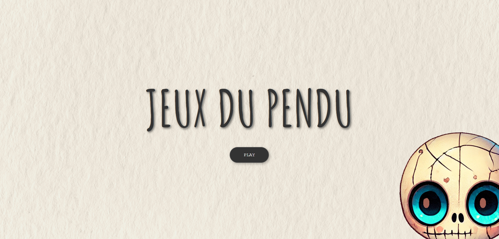
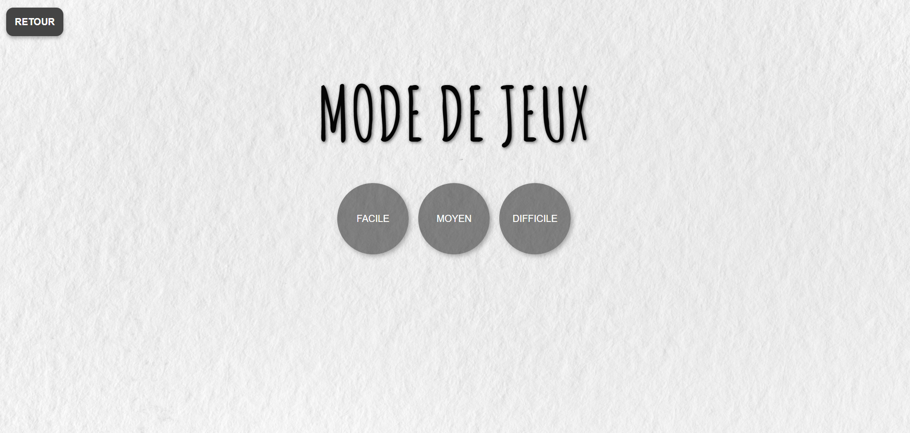
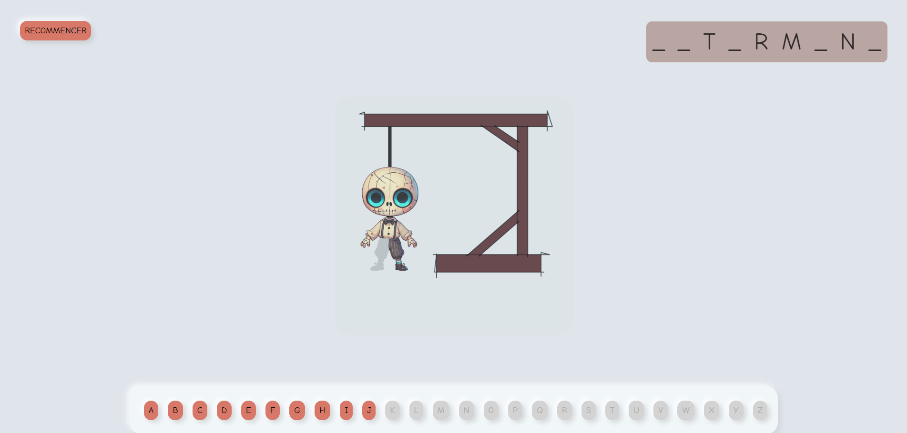
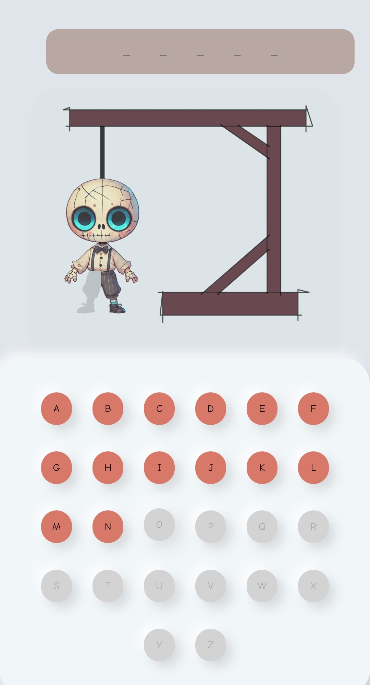

# Mr. Skully - Hangman - Jeux du Pendu -- Novembre 2024 

Jeu du pendu développé en JavaScript pur, sans framework ni bibliothèque CSS.
Mr. Skully n’a que vos bonnes réponses pour éviter la corde…

## Objectifs du projet

- Générer dynamiquement des éléments HTML (alphabet, emplacements)
- Manipuler le DOM avec JavaScript natif
- Gérer les événements utilisateurs (clicks, validation)
- Afficher une logique de jeu (victoire / défaite)
- Le design du personnage (Mr Skully) est une illustration personnelle.

## Technologies utilisées

- HTML5 / CSS3
- JavaScript (vanilla)

## Lancer le projet

Cloner le dépôt :
git clone https://github.com/LaMonaLisa34/Mr.Skully-Hangman-Jeux-du-Pendu.git

## Aperçu du projet 

### Page d'accueil

### Sélection du mode de difficulté 

### Page de jeux

